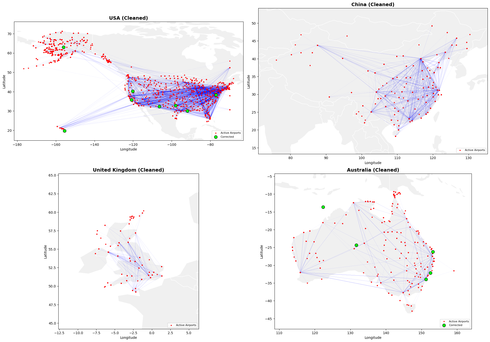
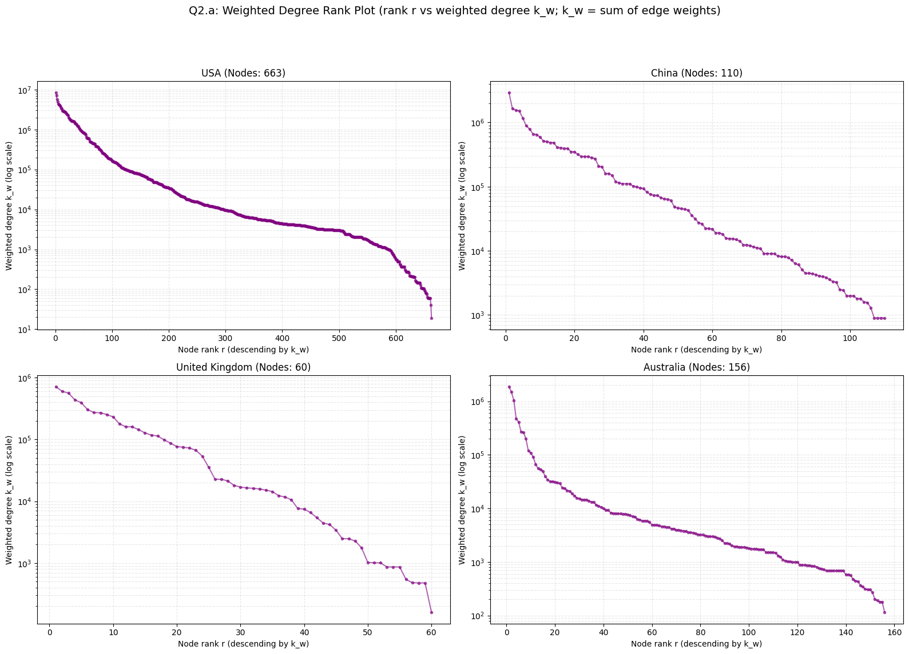
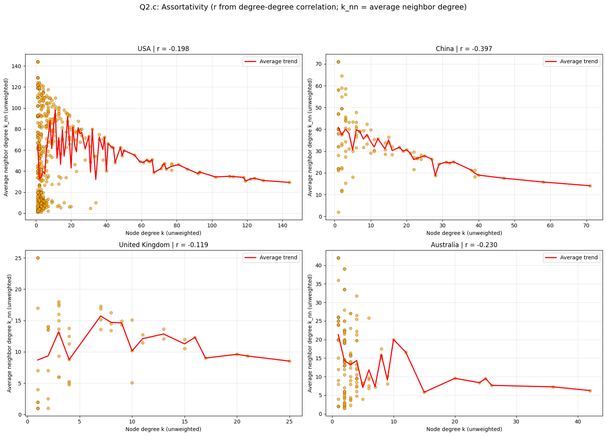
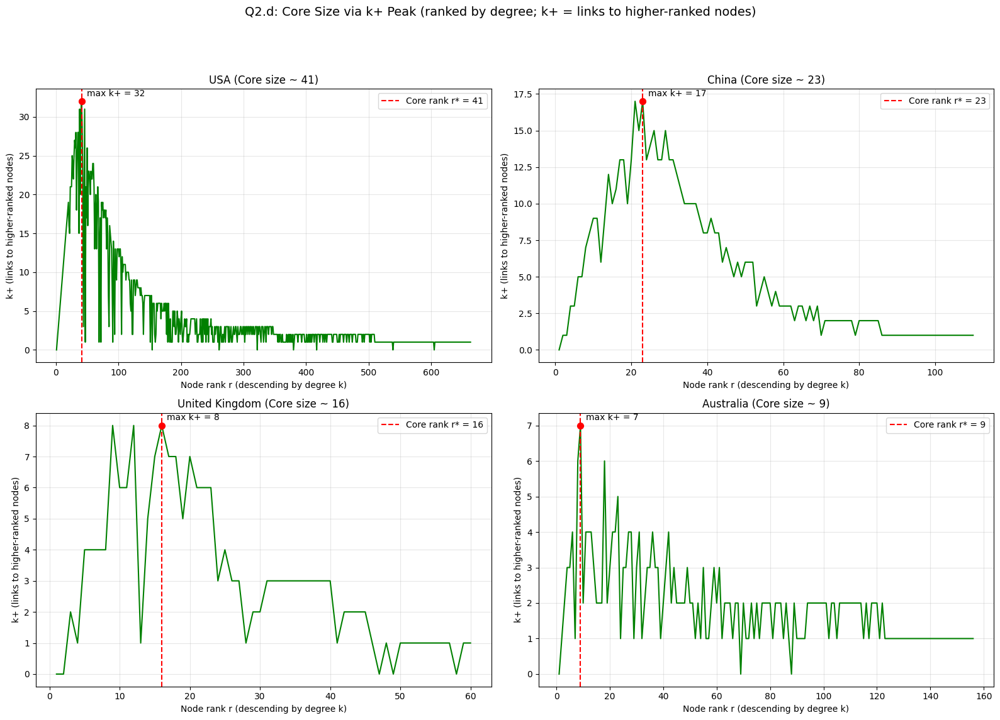

# Air Transport Network Analysis with Python

Graph-based data analysis and visualisation of domestic air transport networks
using Python, GeoPandas and NetworkX.

This project analyses domestic flight networks in the **United States, China,
the United Kingdom and Australia** using one month of flight data. It follows
an end-to-end analytics workflow: data cleaning, network construction, metric
calculation, visualisation and operational interpretation.

---

## What this project demonstrates

- **Data cleaning and validation** — detecting and correcting geospatial
  coordinate errors in airport datasets
- **Network construction** — modelling airports as nodes and flights as
  weighted edges in an undirected graph
- **Geospatial visualisation** — mapping domestic flight networks onto
  geographic basemaps
- **Graph analytics** — computing weighted degree, betweenness centrality,
  degree assortativity and core-periphery structure
- **Operational insight generation** — translating network metrics into
  interpretable findings about hub dominance, resilience and fleet strategy
- **SQL analytics** — equivalent analytical queries for relational database
  environments

---

## Key results

| Country | Assortativity (r) | Core size | Structure |
|---------|------------------:|----------:|-----------|
| USA     | −0.198 | ~41 | Hub–spoke with a critical bridge airport |
| China   | −0.397 | ~23 | Strongly hub-focused, highly disassortative |
| UK      | −0.119 | ~16 | Multi-hub / distributed, more resilient |
| Australia | −0.230 | ~9 | Hub–spoke around coastal hubs |

Larger economies develop larger network cores — providing higher robustness at
the cost of lower economic efficiency. A Random Geometric Graph model with a
distance-penalty parameter (fuel price proxy) is used to reason about future
network evolution and aircraft fleet requirements.

---

## Selected figures

| Cleaned spatial networks | Weighted degree rank |
|---|---|
|  |  |

| Assortativity | Core–periphery (k+ peak) |
|---|---|
|  |  |

---

## Project structure

```
air-transport-network-analysis-python/
├── README.md
├── requirements.txt
├── .gitignore
│
├── notebooks/
│   ├── 01_data_cleaning_and_network_construction.ipynb
│   ├── 02_network_metrics_analysis.ipynb
│   └── 03_operational_interpretation.ipynb
│
├── src/
│   ├── __init__.py
│   ├── data_preprocessing.py
│   ├── network_construction.py
│   ├── network_metrics.py
│   └── visualisation.py
│
├── sql/
│   ├── 01_create_tables.sql
│   ├── 02_domestic_flight_summary.sql
│   ├── 03_top_airport_hubs.sql
│   └── 04_route_volume_analysis.sql
│
├── figures/
│   ├── cleaned_network_maps.png
│   ├── weighted_degree_rank.png
│   ├── degree_betweenness.png
│   ├── degree_betweenness_loglog.png
│   ├── assortativity.png
│   └── core_periphery.png
│
└── data/
    └── README.md
```

---

## How to run

```bash
# Install dependencies
pip install -r requirements.txt

# Run notebooks
cd notebooks
jupyter notebook
```

Open the notebooks in order (01 → 02 → 03). The data files should be placed
in `data/` — see `data/README.md` for details.

---

## Relevance to Data Science and Analytics

This project follows an end-to-end analytics workflow: data cleaning, feature
preparation, network construction, metric calculation, visualisation and
interpretation. The analysis converts complex transport network data into
clear insights about hub dominance, resilience and operational structure —
demonstrating the ability to support data-driven decision making.

---

## Tech stack

Python · pandas · NumPy · NetworkX · GeoPandas · Matplotlib · SQL
